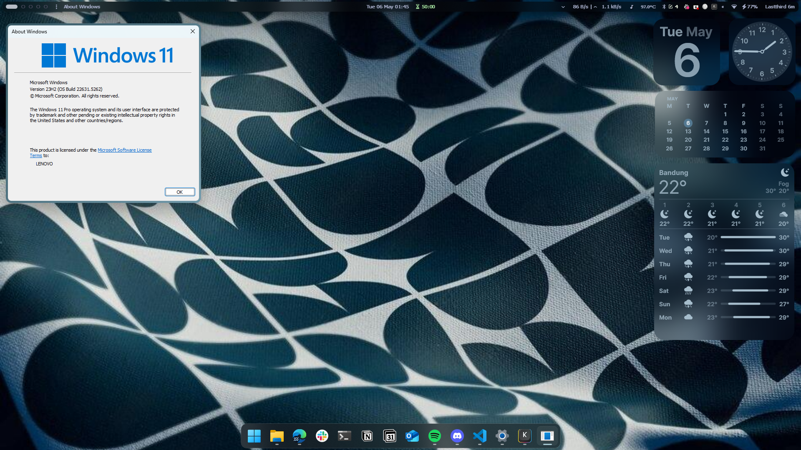

<h1 align="center"> 🌾 Personal Windows 11 Rice 🌾 </h1>

### 🍵 My Personalized Windows Setup  

---

<br/><br/>

---

## 🛠️ Configurations  

### 🔹 UI Enhancements  
- **📌 Topbar:** [Yasb](https://github.com/amnweb/yasb) (My custom [config](.config/yasb/))  
- **🪟 Komorebi:** [Komorebi](https://github.com/LGUG2Z/komorebi) (My Custom [config](.config/))  
- **🖼️ AltSnap:** [AltSnap](https://github.com/RamonUnch/AltSnap/releases)
- **📂 Windhawk:** [Windhawk](https://windhawk.net/) Customizations for Start Menu, Taskbar, and more ([config](windhawk/))  
<br>

--- 
## Usage

1. Open PowerShell / PWSH.
2. Copy and paste this command
```
iex ((New-Object System.Net.WebClient).DownloadString('https://raw.githubusercontent.com/arcfoz/dotfiles/main/install.ps1'))
```